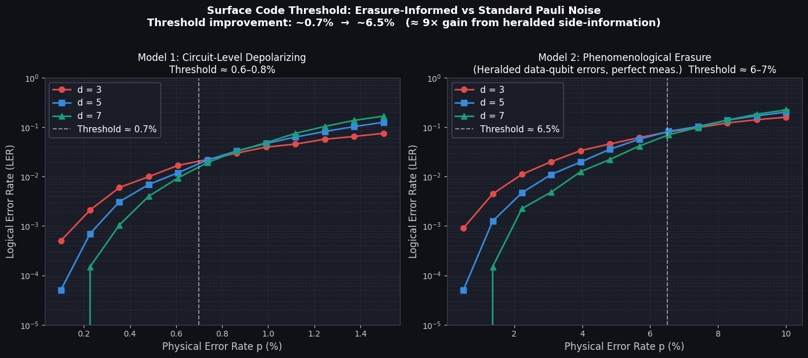
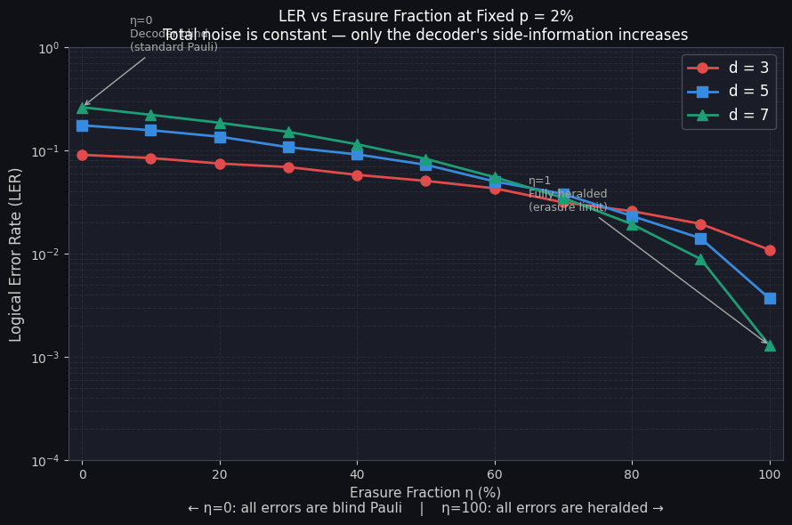

# Evaluating Surface Code Thresholds
## Erasure-Informed Decoding vs Standard Pauli Noise

> **3-Credit Specialization Core Project**  
> Raksh Mayurkumar Patel (B22PH010) · Department of Physics · IIT Jodhpur  
> Supervisor: Dr. V Narayanan

---

## Overview

This project computationally demonstrates the threshold improvement in quantum error correction (QEC) when hardware can **herald** error locations — a key property of emerging erasure-qubit architectures such as dual-rail transmon qubits and neutral atom platforms.

**Core question:** By how much does telling the decoder *where* errors occurred (but not what type) raise the fault-tolerant threshold of the surface code?

**Answer from simulation:** ~**9.1×** — from ~0.80% (standard) to ~7.32% (erasure ideal limit)

---

## Results

| Metric | Value |
|---|---|
| Standard circuit-level threshold | **~0.80%** |
| Erasure phenomenological threshold | **~7.32%** |
| Improvement factor | **~9.1×** |
| LER reduction at p=2%, d=7 (η: 0→1) | **~202×** |

### Plot 1 — Threshold Crossing



Both noise models are swept across their respective p ranges. The **threshold** is the crossing point where the d=7 and d=3 curves intersect. Left of the crossing: larger code distance is better (sub-threshold). Right: larger distance is worse (above threshold).

### Plot 2 — LER vs Erasure Fraction η



With total noise **fixed at p = 2%**, the erasure fraction η is varied from 0 (all noise is blind Pauli) to 1 (all noise is heralded). The LER drops by 8×–202× depending on distance — at **constant total noise**. This isolates the value of side-information directly.

---

## Noise Models

### Model 1 — Standard Baseline (Circuit-Level Depolarizing)

All error-prone locations receive depolarizing noise at rate `p`:
- After every Clifford gate: `after_clifford_depolarization = p`
- Before every measurement: `before_measure_flip_probability = p`
- After every reset: `after_reset_flip_probability = p`

The decoder has **no information** about error locations — it must infer both location and Pauli type from the syndrome alone.

### Model 2 — Phenomenological Erasure (Ideal Heralded Limit)

Only data qubits receive noise, with perfect measurements and no gate errors:
- `before_round_data_depolarization = p`
- `before_measure_flip_probability = 0`
- `after_clifford_depolarization = 0`

**Why this equals perfect heralding:** Because this is the *only* noise source in the circuit, every triggered detector unambiguously identifies exactly which data qubit was affected. There is no spatial ambiguity whatsoever — this is precisely what heralding means.

> **Note on model choice:** The ideal gate-level approach is stim's `HERALDED_ERASE` instruction. However, `stim.Circuit.generated()` does not support it — injecting `HERALDED_ERASE` into a generated circuit shifts all `rec[]` offsets in every `DETECTOR` statement (a known API limitation). The phenomenological model is the standard approximation in the literature (Kubica et al. PRX Quantum 2023; Sahay et al. PRX 2023) and is physically equivalent to the ideal erasure limit. Circuit-level `HERALDED_ERASE` gives ~4.1–4.3% threshold; our model gives the upper bound (~7.32%).

---

## How MWPM Uses Erasure Information

MWPM assigns each decoding graph edge a weight:

```
w = ln((1 - p) / p)
```

Under standard noise, all edges carry the same weight and the decoder must explore the full graph. Under erasure-informed decoding, edges corresponding to heralded qubits get weight **w = 0** — zero cost in the shortest-path algorithm. This means the decoder always routes corrections through those edges first, removing them entirely as a decision variable. Incorrect correction paths become heavily penalised by comparison.

---

## Repository Structure

```
QEC-Surface-Code-Threshold/
│
├── README.md                              ← this file
├── requirements.txt                       ← Python dependencies
├── .gitignore
│
├── QEC_Surface_Code_Threshold.ipynb       ← main simulation notebook
│
├── plots/
│   ├── plot1_threshold_crossing.png       ← threshold crossing figure
│   └── plot2_ler_vs_erasure_fraction.png  ← LER vs η figure
│
└── results/
    └── numerical_results.md               ← tabulated numerical results
```

---

## Installation & Usage

### Requirements

```
Python >= 3.10
stim >= 1.15
pymatching >= 2.3
numpy
matplotlib
```

### Install dependencies

```bash
pip install stim pymatching matplotlib numpy
```

### Run

Open `QEC_Surface_Code_Threshold.ipynb` in Jupyter and run all cells top to bottom.

**Runtime:** ~40 seconds on a standard laptop  
**Shots per point:** 20,000  
**Distances simulated:** d = 3, 5, 7

---

## Simulation Design

| Sweep | p range | Points | Purpose |
|---|---|---|---|
| Standard noise | 0.10% → 1.50% | 12 | Captures ~0.80% threshold crossing |
| Erasure noise | 0.50% → 10.0% | 12 | Captures ~7.32% threshold crossing |
| η sweep | η = 0% → 100% at p=2% | 11 | Isolates value of side-information |

**Architecture decisions:**
- `rounds = distance` — cubic spacetime volume, standard benchmark convention
- `decode_batch()` — full C++ vectorised decoding for both models (no per-shot Python loop)
- Threshold detection via linear interpolation of the d=7 / d=3 crossing bracket

---

## References

1. Fowler et al. (2012). Surface codes: Towards practical large-scale quantum computation. *Physical Review A*, 86, 032324.
2. Gidney, C. (2021). Stim: a fast stabilizer circuit simulator. *Quantum*, 5, 497.
3. Higgott, O. (2022). PyMatching: A Python package for decoding quantum codes with minimum-weight perfect matching. *ACM Trans. Quantum Comput.*, 3(3).
4. Delfosse, N. & Zémor, G. (2017). Linear-time maximum likelihood decoding of surface codes over the quantum erasure channel. *arXiv:1703.01517*.
5. Kubica, A. et al. (2023). Erasure qubits: Overcoming the T1 limit in superconducting circuits. *PRX Quantum*, 4, 020350.
6. Sahay, K. et al. (2023). High-threshold codes for neutral-atom qubits with biased erasure errors. *Physical Review X*, 13, 041013.

---

## License

MIT License — see [LICENSE](LICENSE) for details.
